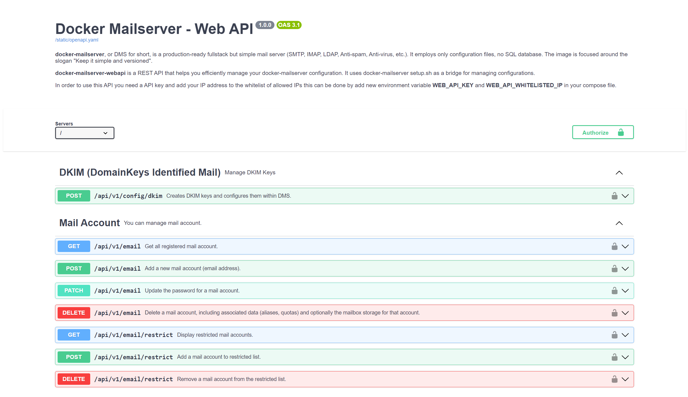

<a name="readme-top"></a>

<div align="center">
  <a href="https://github.com/bramanda48/docker-mailserver-webapi">
    
  </a>
  <h2 align="center">Docker Mailserver - Web API</h2>
  <div align="center">
    <p align="center">a REST API that helps you efficiently manage your <a href="https://github.com/docker-mailserver/docker-mailserver" title="Docker Mailserver">docker-mailserver</a> configuration.</p>
    <div>
        <a href="https://github.com/bramanda48/docker-mailserver-webapi/releases/"></a>
        <a href="https://github.com/bramanda48/docker-mailserver-webapi#license"></a>
    </div>
  </div>
</div>

---

| Branch  | Status            |
|---------|-------------------|
| master  |  |
| develop |  |

## Installation & Usage

1. Create new file `user-patches.sh` in config folder.
2. Add this script inside `user-patches.sh`.
   ```bash
    #!/bin/bash

    curl -fsSL https://raw.githubusercontent.com/bramanda48/docker-mailserver-webapi/master/scripts/user-patches.sh | bash
   ```
3. By default, this application will run on port 3000. You need add the port to `docker-compose.yml`.
4. Redeploy the container.

## License

This project is licensed under the MIT License - see the [LICENSE.md](https://github.com/bramanda48/docker-mailserver-webapi/blob/master/LICENSE.md) file for details.

## Acknowledgments

Inspiration, code snippets, icon, etc.
* [Docker Mailserver](https://github.com/docker-mailserver/docker-mailserver) by The Docker Mailserver Organization & Contributors.